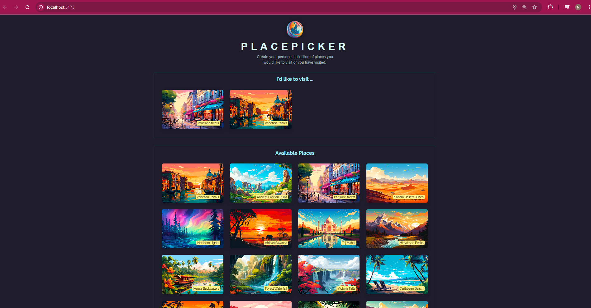

# PlacePicker

PlacePicker is a modern web application that helps users discover and explore interesting places. The application provides a user-friendly interface for browsing and selecting locations, with detailed information about each place.

## Screenshots

Here are some glimpses of the PlacePicker application:


*Main view showing selected places and available places.*


*Scrolling through the extensive list of available places.*


## Technologies Used

### Frontend
- **React** (v19.0.0) - A JavaScript library for building user interfaces
- **Vite** - Next Generation Frontend Tooling
- **ESLint** - For code linting and maintaining code quality

### Backend
- **Node.js** - JavaScript runtime environment
- **Express.js** - Web application framework
- **Body-parser** - Middleware for parsing incoming request bodies

## Features
- Modern and responsive user interface
- Interactive place selection
- Detailed place information
- Fast and efficient data loading

## Getting Started

### Prerequisites
- Node.js (v14 or higher)
- npm (Node Package Manager)

### Installation

1. Clone the repository:
```bash
git clone https://github.com/Nikola-Separovic/PlacePicker.git
cd PlacePicker
```

2. Install frontend dependencies:
```bash
npm install
```

3. Install backend dependencies:
```bash
cd backend
npm install
```

### Running the Application

1. Start the frontend development server:
```bash
npm run dev
```

2. Start the backend server:
```bash
cd backend
node app.js
```

The application will be available at `http://localhost:5173` (frontend) and `http://localhost:3000` (backend).

## Project Structure
```
PlacePicker/
├── screenshots/      # Application screenshots
├── src/              # Frontend source code
├── backend/          # Backend server code
│   ├── data/        # Data files
│   ├── images/      # Image assets
│   └── app.js       # Backend server
├── public/          # Static assets
└── package.json     # Frontend dependencies
```

## Contributing
Feel free to submit issues and enhancement requests.

## License
This project is licensed under the ISC License. 
